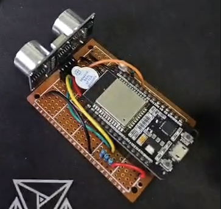

 

  

  <h3 align="center">Projeto Zubat</h3>

![c-shield]

## Sobre o projeto

Zubat é um projeto experimental que utiliza um sensor ultrassônico para medir distância e emitir bipes sonoros proporcionais à proximidade de obstáculos.

A ideia é servir como um auxílio simples de percepção espacial, inspirado em sistemas de ecolocalização, podendo ser usado em dispositivos vestíveis, como um boné, para ajudar pessoas com deficiência visual.

## Componentes utilizados
- ESP32 Devkit
- Buzzer ativo
- Sensor ultrassônico HC-SR04
- Led 5mm 1.8V
- 4 x resistores 220 ohms

## Como funciona

O Zubat utiliza um sensor ultrassônico HC-SR04 para medir continuamente a distância até obstáculos à frente do usuário.
Com base nessa distância, o sistema gera alertas sonoros através de um buzzer ativo, permitindo que a proximidade seja percebida de forma auditiva.

As leituras são feitas a cada ~50 ms para manter estabilidade e evitar ruídos no sensor.

### Lógica de distância e alertas sonoros
A distância medida (em centímetros) é convertida em padrões de som conforme a tabela abaixo:

| Distância detectada        | Estado             | Comportamento do buzzer |
| -------------------------- | ------------------ | ----------------------- |
| 0 – 10 cm                  | 🚨 Perigo          | Som contínuo            |
| 11 – 40 cm                 | ⚠️ Atenção         | Bipes rápidos (~100 ms) |
| 41 – 80 cm                 | ℹ️ Alerta distante | Bipes lentos (~500 ms)  |
| > 80 cm ou fora de alcance | ----               | Silencioso              |

Essa lógica permite que o usuário identifique não apenas a presença de obstáculos, mas também o quão próximos eles estão, sem a necessidade de visão.

## Licença

Distribuido sobre a license MIT. Veja o arquivo `LICENSE` para mais informações.

[c-shield]: https://img.shields.io/badge/C++-00599C?style=flat-square&logo=C%2B%2B&logoColor=white

